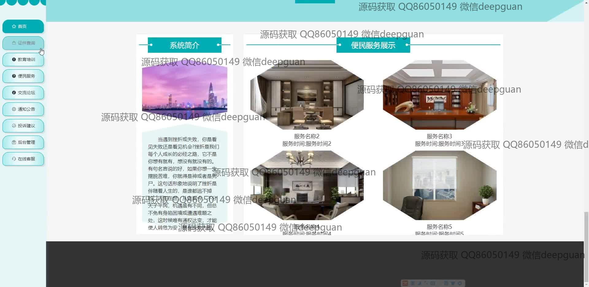
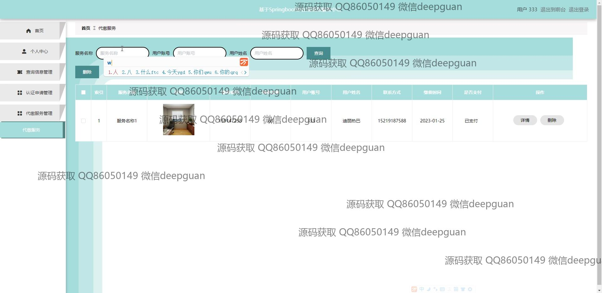
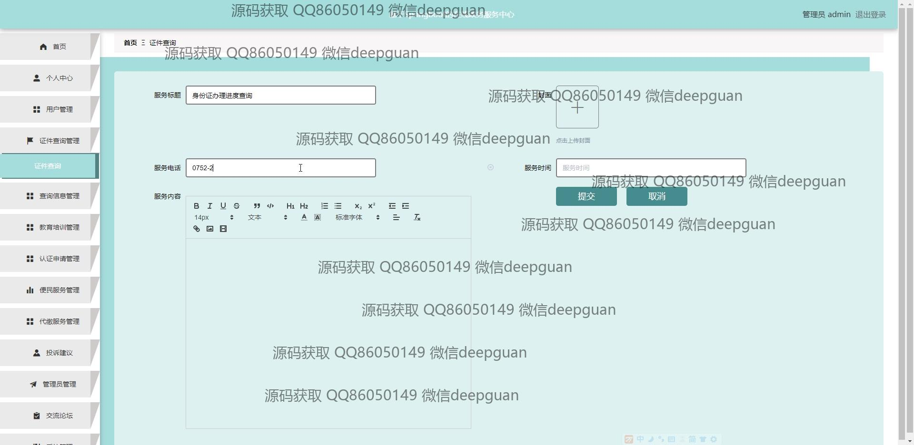
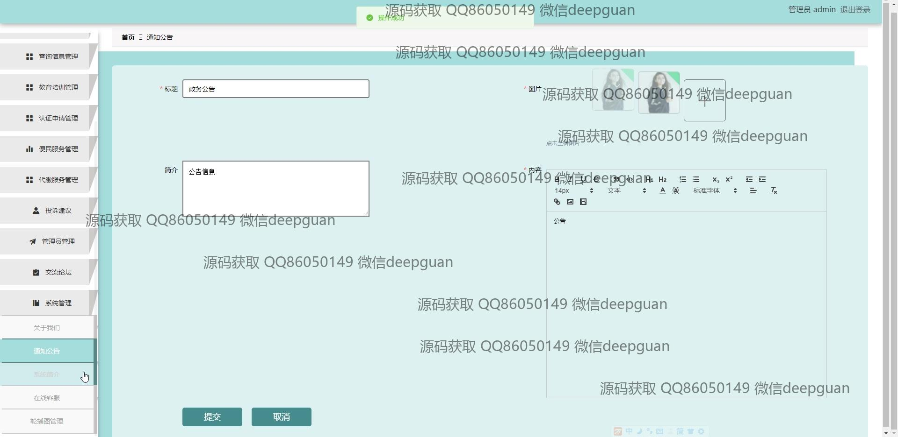

<h1 align="center">基于Springboot的在线政务服务中心</h1>

## 简介
基于Springboot的在线政务服务中心：系统角色包括管理员和用户，提供证件查询、教育培训、便民服务、交流论坛、投诉建议等功能，实现高效的在线政务信息管理和用户交互。    --计算机毕业设计源码；毕设源码；java毕业设计源码

## 联系方式

<h3 align="center">获取完整代码与数据库文件 + 微信：deepguan QQ: 86050149 QQ群: 783742310</h3>

<h3 align="center">可帮忙远程部署 包运行成功！提供远程部署、修改代码、设计文档指导、代码讲解等服务！</h3>

## 功能介绍（完整见运行截图）
管理员：管理员具备的功能包括用户及服务管理，投诉审核与回复，信息内容编辑，轮播图和系统简介管理。此外，管理员可以通过后台管理界面对系统的整体操作进行查看和维护，并负责审核用户提交的认证申请和更新公告信息。

用户：用户可以注册账户并登录系统，访问证件查询、教育培训、便民服务、交流论坛和通知公告等功能。用户可以在个人中心查看和修改个人信息，查询和提交证件申请及相关服务，参与论坛交流，并对平台服务提出投诉建议。交流论坛和在线客服功能提高了用户与平台之间的互动效率。

## 运行截图

本代码来源于网络,仅供学习参考使用!

